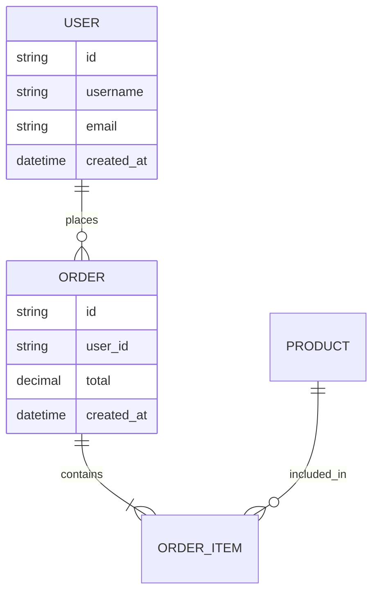

# 软件设计文档 (SDD) - 项目名称

> **文档版本:** 1.0  
> **创建日期:** 2026-04-10  
> **最后更新:** 2026-04-10  
> **负责人:** [填写负责人姓名]  
> **状态:** 草稿/评审中/已批准

---

## 1. 引言 (Introduction)

### 1.1 目的
本软件设计文档 (SDD) 旨在详细描述 [项目名称] 系统的架构设计、组件结构、数据流、接口规范及关键技术决策。本文档面向开发人员、测试人员、架构师及项目相关利益方。

### 1.2 范围
- **包含内容:** 系统整体架构、核心模块设计、数据库设计、接口规范、安全设计、部署方案
- **不包含内容:** 具体代码实现细节、用户界面设计 (见 UI 文档)、项目管理流程

### 1.3 术语定义
| 术语 | 定义 |
|------|------|
| SDD | Software Design Document，软件设计文档 |
| API | Application Programming Interface，应用程序编程接口 |
| DB | Database，数据库 |
| UI | User Interface，用户界面 |
| [其他术语] | [定义] |

### 1.4 参考资料
- [需求规格说明书 (SRS) 链接]
- [项目立项文档链接]
- [相关技术标准/规范链接]

---

## 2. 系统概述 (System Overview)

### 2.1 系统目标
- **核心目标:** [用一句话描述系统要解决的核心问题]
- **业务目标:** [列出 3-5 个关键业务目标]
- **技术目标:** [列出 3-5 个关键技术目标，如性能、可扩展性、安全性等]

### 2.2 用户群体
| 用户类型 | 描述 | 核心需求 |
|----------|------|----------|
| 普通用户 | 系统的最终使用者 | [需求列表] |
| 管理员 | 系统运维和管理人员 | [需求列表] |
| 开发人员 | 系统开发和维护人员 | [需求列表] |

### 2.3 假设与依赖
- **假设:** [列出项目依赖的关键假设]
- **外部依赖:** [列出第三方服务、API、库等依赖]
- **技术依赖:** [列出技术栈、框架、中间件等依赖]

---

## 3. 系统架构 (System Architecture)

### 3.1 架构风格
- **架构模式:** [如：微服务架构/单体架构/事件驱动架构/分层架构]
- **选择理由:** [说明选择该架构的原因]

### 3.2 架构视图

#### 3.2.1 逻辑架构
```
[使用 Mermaid 或文字描述逻辑分层]
示例:
表示层 (UI/API Gateway)
    ↓
业务逻辑层 (Service Layer)
    ↓
数据访问层 (Repository/DAO)
    ↓
数据存储层 (Database/Cache)
```

#### 3.2.2 物理架构
```
[描述部署节点、网络拓扑、负载均衡等]
- Web 服务器: [数量、配置]
- 应用服务器: [数量、配置]
- 数据库服务器: [数量、配置、主从/集群]
- 缓存服务器: [如 Redis 集群]
- 消息队列: [如 Kafka/RabbitMQ]
```

#### 3.2.3 部署架构
```yaml
环境: 开发/测试/生产
区域: [部署的地理区域]
容器化: Docker/Kubernetes
CI/CD: [使用的工具链]
```

### 3.3 技术栈
| 层级 | 技术选型 | 版本 | 选择理由 |
|------|----------|------|----------|
| 前端 | [如 React/Vue] | [版本] | [理由] |
| 后端 | [如 Node.js/Java/Python] | [版本] | [理由] |
| 数据库 | [如 PostgreSQL/MySQL/MongoDB] | [版本] | [理由] |
| 缓存 | [如 Redis] | [版本] | [理由] |
| 消息队列 | [如 Kafka/RabbitMQ] | [版本] | [理由] |
| 容器编排 | [如 Kubernetes] | [版本] | [理由] |

---

## 4. 模块设计 (Module Design)

### 4.1 模块划分
[按功能域或业务边界划分模块]

#### 4.1.1 模块 A: [模块名称]
- **职责:** [模块的核心职责]
- **功能列表:**
  - [功能 1]
  - [功能 2]
- **接口:** [对内外提供的 API]
- **依赖:** [依赖的其他模块/服务]
- **关键类/组件:**
  ```
  [列出关键类/组件及其职责]
  ```

#### 4.1.2 模块 B: [模块名称]
[同上结构]

### 4.2 模块间接口
| 接口名称 | 调用方 | 被调用方 | 协议 | 描述 |
|----------|--------|----------|------|------|
| [接口名] | [模块 A] | [模块 B] | [HTTP/gRPC/消息] | [描述] |

### 4.3 核心流程
[使用流程图或时序图描述关键业务流程]

```mermaid
sequenceDiagram
    participant 用户
    participant 网关
    participant 服务 A
    participant 服务 B
    participant 数据库

    用户->>网关：请求
    网关->>服务 A：转发
    服务 A->>服务 B：调用
    服务 B->>数据库：查询
    数据库-->>服务 B：返回
    服务 B-->>服务 A：响应
    服务 A-->>网关：响应
    网关-->>用户：返回结果
```

---

## 5. 数据设计 (Data Design)

### 5.1 数据模型
[描述核心实体及其关系]

#### 5.1.1 实体关系图 (ERD)


### 5.2 数据库设计

#### 5.2.1 表结构
**表名:** `users`
| 字段名 | 类型 | 约束 | 说明 |
|--------|------|------|------|
| id | UUID | PRIMARY KEY | 用户 ID |
| username | VARCHAR(50) | NOT NULL, UNIQUE | 用户名 |
| email | VARCHAR(100) | NOT NULL, UNIQUE | 邮箱 |
| password_hash | VARCHAR(255) | NOT NULL | 密码哈希 |
| created_at | TIMESTAMP | DEFAULT NOW() | 创建时间 |
| updated_at | TIMESTAMP | DEFAULT NOW() | 更新时间 |

**表名:** `orders`
[同上结构]

### 5.3 缓存设计
- **缓存策略:** [如：Cache-Aside/Write-Through]
- **缓存内容:** [哪些数据需要缓存]
- **过期策略:** [TTL/主动失效]
- **一致性保证:** [如何保证缓存与数据库一致性]

### 5.4 数据流
[描述数据在系统中的流转过程]

---

## 6. 接口设计 (Interface Design)

### 6.1 内部接口
[模块间调用的 API]

#### 6.1.1 用户服务
- **端点:** `POST /api/v1/users`
- **描述:** 创建新用户
- **请求体:**
  ```json
  {
    "username": "string",
    "email": "string",
    "password": "string"
  }
  ```
- **响应:**
  ```json
  {
    "id": "uuid",
    "username": "string",
    "created_at": "timestamp"
  }
  ```

### 6.2 外部接口
[与第三方系统集成的 API]

| 接口名称 | 提供方 | 用途 | 协议 | 认证方式 |
|----------|--------|------|------|----------|
| 支付接口 | 支付宝/微信 | 处理支付 | HTTP | OAuth2 |
| 短信接口 | 阿里云 | 发送验证码 | HTTP | API Key |

### 6.3 API 规范
- **风格:** RESTful / GraphQL / gRPC
- **版本管理:** URL 路径版本化 (`/api/v1/`)
- **错误处理:** 统一错误码规范
- **限流策略:** [如：令牌桶/滑动窗口]

---

## 7. 安全设计 (Security Design)

### 7.1 认证与授权
- **认证方式:** [如：JWT/OAuth2/SAML]
- **授权模型:** [如：RBAC/ABAC]
- **会话管理:** [会话超时、续期策略]

### 7.2 数据安全
- **传输加密:** TLS 1.3
- **存储加密:** [数据库字段级加密/磁盘加密]
- **敏感信息:** [密码哈希算法 (如 bcrypt)、密钥管理]

### 7.3 安全防护
- **XSS 防护:** 输入验证、输出转义
- **CSRF 防护:** Token 验证
- **SQL 注入防护:** 参数化查询
- **DDoS 防护:** 限流、WAF

### 7.4 审计与日志
- **审计内容:** [登录、关键操作、数据变更]
- **日志级别:** DEBUG/INFO/WARNING/ERROR
- **日志存储:** [集中式日志系统如 ELK]

---

## 8. 非功能性需求 (Non-Functional Requirements)

### 8.1 性能需求
| 指标 | 目标值 | 测量方法 |
|------|--------|----------|
| 响应时间 (P95) | < 200ms | 压测工具 |
| 吞吐量 | > 1000 QPS | 压测工具 |
| 并发用户数 | > 10000 | 压测工具 |

### 8.2 可用性
- **SLA:** 99.9%
- **容灾方案:** [多活/主从/冷备]
- **故障恢复:** RTO < 5 分钟，RPO < 1 分钟

### 8.3 可扩展性
- **水平扩展:** [无状态服务，支持动态扩容]
- **垂直扩展:** [数据库读写分离/分库分表]

### 8.4 可维护性
- **代码规范:** [遵循的编码规范]
- **文档要求:** [API 文档、注释规范]
- **监控告警:** [Prometheus + Grafana]

---

## 9. 部署与运维 (Deployment & Operations)

### 9.1 部署方案
- **环境划分:** 开发/测试/预发布/生产
- **部署方式:** 蓝绿部署/滚动更新/金丝雀发布
- **回滚策略:** [如何快速回滚]

### 9.2 监控方案
- **系统监控:** CPU、内存、磁盘、网络
- **应用监控:** 接口响应时间、错误率、QPS
- **业务监控:** 核心业务指标
- **告警渠道:** 邮件/短信/钉钉/企业微信

### 9.3 备份策略
- **数据库备份:** 全量 + 增量，每日/每小时
- **备份存储:** 异地备份
- **恢复演练:** 每季度一次

---

## 10. 风险与挑战 (Risks & Challenges)

| 风险项 | 可能性 | 影响程度 | 缓解措施 |
|--------|--------|----------|----------|
| [技术风险] | 中 | 高 | [应对方案] |
| [依赖风险] | 低 | 中 | [应对方案] |
| [人员风险] | 中 | 中 | [应对方案] |

---

## 11. 附录 (Appendix)

### 11.1 设计决策记录
| 决策项 | 选项 A | 选项 B | 最终选择 | 理由 |
|--------|--------|--------|----------|------|
| 数据库选型 | MySQL | PostgreSQL | PostgreSQL | 支持 JSON 字段、更好的并发控制 |

### 11.2 待确定事项 (TBD)
- [ ] [待确认的技术点 1]
- [ ] [待确认的业务逻辑 2]

### 11.3 版本历史
| 版本 | 日期 | 作者 | 变更内容 |
|------|------|------|----------|
| 1.0 | 2026-04-10 | [作者] | 初始版本 |

---

**文档结束**
